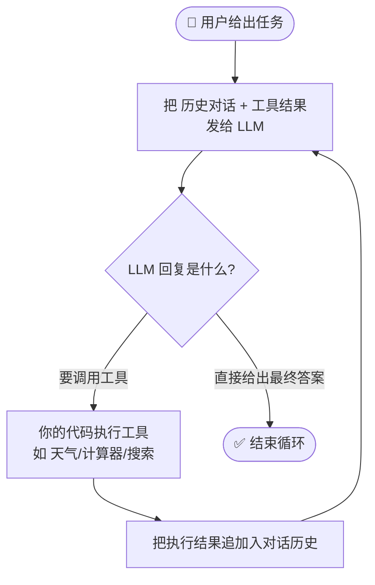

# Week 1 学习笔记：核心概念 + 两篇必读文档精读

> 日期：2026-08-19
> 资料：Anthropic《Building Effective Agents》 + OpenAI《A Practical Guide to Building Agents》

---

# 一、四个核心概念

**一句话记忆：LLM 是大脑，Tool Use 是手脚，Agent Loop 是心跳，Context Window 是脑容量。**

## 1. LLM（大语言模型）

本质：文本进、文本出的超大型概率模型，训练目标是预测下一个 token。

工程特性：

| 特性 | 含义 | 对 Agent 的影响 |
|------|------|----------------|
| 无状态 | 每次调用独立，模型不记得上一次 | 对话历史必须每次完整传入 |
| 概率性 | 同样输入可能有不同输出 | 行为不可完全预测，需要护栏 |
| 只能输出文本 | 不能真的"执行"操作 | 做事必须靠 Tool Use |
| 按 token 计费 | 输入+输出都算钱 | Agent 多轮循环会放大成本 |

## 2. Tool Use（工具调用 / Function Calling）⭐

Agent 的核心机制。

- 模型不能联网/执行代码/读数据库，只会输出文字
- 解决方式：给它一份"工具菜单"（JSON Schema 描述工具的名字、用途、参数）
- 模型判断需要时，输出结构化调用请求（不是普通文字）：

```json
{
  "tool": "get_weather",
  "arguments": { "city": "北京" }
}
```

**关键分工（易误解点）：**

```
模型：决策者（大脑）        你的程序：执行者（手脚）
     ↓ 输出调用请求              ↓ 真正执行函数
     └─────── 结果返回给模型 ───────┘
```

模型只负责决定调哪个工具、传什么参数；真正执行的是你的代码。

## 3. Agent Loop（Agent 循环）⭐⭐

所有 Agent 系统的心脏（包括 Claude Code）。本质是一个 while 循环：

```
用户给出任务
    ↓
┌─────────────────────────────────┐
│  把 [历史对话 + 工具结果] 发给 LLM   │◄──────────┐
└──────────────┬──────────────────┘           │
               ↓                              │
        LLM 的回复是什么？                      │
     ┌─────────┴─────────┐                    │
     ↓                   ↓                    │
  要调用工具          直接给出最终答案           │
     ↓                   ↓                    │
 你的代码执行工具      ✅ 结束循环               │
     ↓                                        │
 把执行结果追加到对话历史 ──────────────────────┘
```

四种退出条件：
1. 模型输出最终答案（不再要求调工具）
2. 调用了专门的"输出结果"工具
3. 发生错误
4. 达到最大轮数（**必须设置**，防止死循环烧钱）

理解它就能明白 Claude Code 为什么能"自己发现错误、自己修复"——
报错信息作为工具结果回到循环里，模型看到后再决定下一步。

> 📌 Week 3 任务就是手写这个循环，务必彻底理解。

## 4. Context Window（上下文窗口）

模型的"工作记忆"容量上限（以 token 计，如 200K token ≈ 15 万汉字）。
每次调用都要塞进窗口：系统提示词 + 完整对话历史 + 工具定义 + 工具返回结果。

工程影响：
1. **成本**：Agent 每轮循环都带全部历史，越到后面越贵
2. **性能退化**：内容太长注意力被稀释，容易忘事出错
3. **必须做记忆管理**：
   - 摘要压缩（Claude Code 的 /compact 就是这个）
   - 外部存储 + RAG，用的时候现查（Week 5-6 学）
   - 截断丢弃久远内容

---

# 二、Anthropic《Building Effective Agents》精读

核心思想：**生产环境里最成功的 Agent，用的都是简单、可组合的模式，而不是复杂框架。**

## 核心区分：Workflow vs Agent（全文最重要的概念）

| | Workflow（工作流） | Agent（智能体） |
|---|---|---|
| 执行路径 | 预先写死在代码里，LLM 按固定路线走 | 模型自己动态决定流程和工具 |
| 控制权 | 程序员 | 模型 |
| 适用 | 任务可预测、步骤固定 | 开放式问题，步骤无法预先确定 |
| 成本/可控性 | 便宜、可预测 | 贵、慢，但能力强 |

## 五大工作流模式

**① 提示链（Prompt Chaining）**：任务拆成固定步骤流水线，步骤之间可加程序检查点（gate）
- 例：生成大纲 → 检查大纲 → 写全文；先写文案再翻译

**② 路由（Routing）**：先分类输入，再分发给专门流程
- 例：客服问题分类后走不同流程；简单问题给小模型，复杂问题给大模型

**③ 并行化（Parallelization）**：多个 LLM 调用同时跑再合并
- 分段（Sectioning）：不同子任务并行
- 投票（Voting）：同一任务跑多次取共识
- 例：安全检查与生成回答并行；多模型独立审计漏洞

**④ 编排者-工作者（Orchestrator-Workers）**：中央模型动态拆任务、分派、汇总
- 例：多文件代码修改（改哪些文件事先无法知道）
- 与并行化的区别：分工是运行时动态生成的，不是预先定好的

**⑤ 评估者-优化者（Evaluator-Optimizer）**：一个生成、一个挑刺，循环迭代
- 例：文学翻译的翻译+评审循环
- 前提：有明确评判标准，且迭代确实能提升质量

## 什么时候才需要真正的 Agent？

开放式问题——步骤无法硬编码、且信任模型决策能力时。
警告：自主性带来成本上升和错误累积 → 沙盒测试 + 护栏 + 最大迭代次数。
Agent 每一步都需要环境的**事实依据**（ground truth）：工具返回数据、代码执行输出。

## 三条黄金建议

1. 保持简单——只在有明确收益时增加复杂度
2. 让规划过程可见——展示思考/计划步骤，便于调试
3. 精心设计 Agent-计算机接口（ACI）——工具文档和测试要和提示词一样认真

## 附录：工具设计要点

- 工具名称清晰、描述详尽、给示例、说明边界情况
- 防呆设计（Poka-yoke）：让错误难以发生（案例：相对路径总出错 → 改用绝对路径）
- 作者实测：调优工具花的时间比调优提示词还多
- 格式贴近自然文本，别让模型做无意义苦力（精确 diff 行数、JSON 转义等）

---

# 三、OpenAI《A Practical Guide to Building Agents》精读

## Agent 的定义

> Agent 是代替你独立完成任务的系统。

判断标准：**LLM 是否控制了工作流的执行**。
❌ 不是 Agent：简单聊天机器人、单轮问答、情感分类器（只是"用了 LLM 的应用"）。

两个核心特征：
1. 用 LLM 管理流程、做决策——识别任务完成、主动纠错、失败时交还控制权
2. 有工具访问外部系统——动态选择工具，始终在护栏内行动

## 什么时候该建 Agent？（三个信号）

优先选择传统自动化搞不定的流程：
1. **复杂决策**——灵活判断、处理例外（例：退款审批）
2. **规则难以维护**——if-else 堆积成山（例：供应商安全审查）
3. **重度依赖非结构化数据**——理解自然语言、读文档（例：保险理赔）

精彩类比：传统规则引擎像**检查清单**，LLM Agent 像**经验丰富的调查员**。

## Agent 三要素

```
Agent = 模型（Model）+ 工具（Tools）+ 指令（Instructions）
```

**模型选择策略：**
- 不是所有任务都需要最强模型：分类用小模型，退款决策用大模型
- 流程：先用最强模型建原型 → 建基线 → 逐个换小模型测试

**工具三分类：**

| 类型 | 作用 | 例子 |
|------|------|------|
| 数据类 | 获取上下文 | 查数据库、读 PDF、搜索 |
| 行动类 | 改变外部系统 | 发邮件、更新记录、转人工 |
| 编排类 | Agent 作为别的 Agent 的工具 | 退款 Agent、调研 Agent |

**指令编写技巧：**
- 利用现有文档（知识库、SOP）转化；可让大模型自动把文档转成指令
- 每步对应明确动作；边界情况提前写进指令

## 编排：先单 Agent，再多 Agent

**单 Agent 优先**——不断加工具扩展能力，简单好维护。核心是运行循环（while 直到退出条件）。
技巧：用带变量的提示词模板，而不是维护一堆独立提示词。

**拆多 Agent 的时机：**
- 提示词塞满 if-else 分支时
- 工具过载——问题不在数量而在**相似度**：15 个清晰工具 OK，10 个重叠工具会选错

**多 Agent 两种模式：**

| 模式 | 结构 | 适用 |
|------|------|------|
| 管理者（Manager） | 中央 Agent 把专家 Agent 当工具调用 | 需统一控制、统一面对用户 |
| 去中心化（Decentralized） | 平级 Agent 互相移交（handoff）控制权 | 专家完全接管，无需中央控制 |

例：客服分诊 Agent 接到"订单到哪了" → 移交给订单管理 Agent 全权处理。

## 护栏（多层防御）

1. 相关性分类器——拦截跑题
2. 安全分类器——拦截越狱/提示词注入
3. PII 过滤器——防泄露个人隐私
4. 内容审核——拦截有害内容
5. 工具安全评级——按风险分级（只读/可写？可撤销？涉及钱？），高风险先暂停确认
6. 规则式防御——黑名单、长度限制、正则
7. 输出验证——符合品牌价值观

建设原则：先保数据隐私+内容安全 → 按真实事故补护栏 → 安全与体验持续调优。

## 人工介入

两种必须转人工的情况：
1. 失败超限——重试多次仍搞不定
2. 高风险操作——不可逆或金额大（取消订单、大额退款、付款）

---

# 四、两家公司的共识

| 共识 | Anthropic | OpenAI |
|------|-----------|--------|
| 从简单开始 | 用最简单可行的方案 | 增量式优于一步到位 |
| 单 Agent 优先 | 能用 workflow 就不用 agent | 先榨干单 Agent 能力 |
| 工具设计至关重要 | ACI 要像设计 UI 一样认真 | 文档完善、测试充分、可复用 |
| 自主性需要约束 | 沙盒+护栏+最大迭代数 | 多层护栏+人工介入 |
| 不是所有事都该用 Agent | 一次带检索的调用往往就够 | 满足三信号才值得建 |

**互补视角：** Anthropic 偏设计模式（五大模式讲得深），OpenAI 偏工程落地（模型选型、护栏、人工介入更具体）。

---

# 五、我的思考 ✅（2026-08-19 完成）

## 1. 自己画的 Agent Loop 图（Mermaid 版）



画图心得：Agent Loop 的本质是**一条主循环 + 两个出口**。
- 唯一的回环路径是"执行工具 → 结果回到模型"，模型是唯一决策者；
- 出口永远由模型控制（它说结束才结束），所以"最大轮数硬限制"是程序员的保命护栏。

## 2. 我的日常任务中符合"建 Agent 三信号"的候选

| 任务 | 命中的信号 | 思路 |
|------|-----------|------|
| 📚 课程笔记自动整理 | 重度依赖非结构化数据 | 喂课件/网课文字 → 自动写摘要、划重点、生成错题 |
| 📝 作业要求拆解与检查 | 复杂决策 + 非结构化数据 | 喂作业要求 + 评分标准 → 拆子任务、查漏、对照打分 |
| 💬 消息分类与提醒 | 规则难维护 + 非结构化 | 自动分类（课程群/社团/家人）、标优先级、识别待办 |

> 这三个先列入候选清单，Week 9 做作品集项目时再挑一个深入。

## 3. 疑问记录与解答

### ❓ Agent 怎么知道它自己错了、怎么纠错？
**答：** Agent 本身没有"自我意识"，纠错靠三件事——
1. **错误回到循环**：工具执行报错（如 API 返回 500、文件找不到）作为文本回到对话历史，模型看到后主动决定改参数重试或换工具；
2. **环境事实依据（ground truth）**：每一步都有真实反馈（如代码运行输出了什么），模型据此判断上一步对不对；
3. **护栏兜底**：最大轮数、超时、无效输出重试。OpenAI 建议"失败超限/高风险操作转人工"。

所以它看起来"会自己改 bug"，其实是"程序把报错喂回给了模型"。→ 这正好是 Week 3 手写 Agent Loop 时要亲手实现的核心。

### ❓ 多 Agent 之间怎么协作？
**答：** 两种主流模式（Anthropic 叫 Orchestrator-Workers，OpenAI 叫 Manager / Handoff）：
- **管理者模式（Manager）**：中央 Agent 把其他专家 Agent 当"工具"调，统一决策 + 统一面对用户，适合需要全程控制的任务；
- **去中心化（Handoff）**：平级 Agent 直接移交控制权，比如客服分诊 Agent 说"订单问题 → 移交订单 Agent"，之后订单 Agent 全权负责。

**核心心法：先榨干单 Agent（加工具）再说，别一上来就拆多 Agent。** 拆分的两个信号：提示词塞满 if-else、工具多到互相重叠选错。
